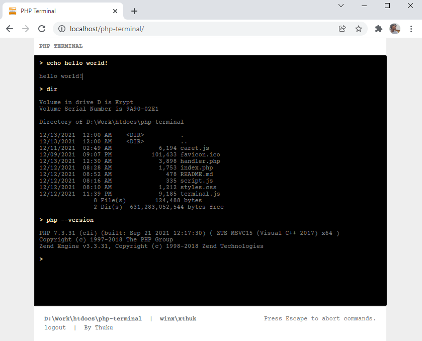

# php-terminal

## A simple HTML/JavaScript/PHP terminal emulator.

#

The file **handler.php** processes requests.

To authenticate, enter pass phrase in url _auth_ query:

```?auth=[PASS_PHRASE]```

For example:

```http://localhost/php-terminal?auth=alohomora```

To change the pass phrase, edit **handler.php** file.

```php
<?php

//auth pass phrase - edit to change
define('PASS_PHRASE', 'alohomora');

//...
```

#



#

### 💖 By Thuku. _**Enjoy!**_