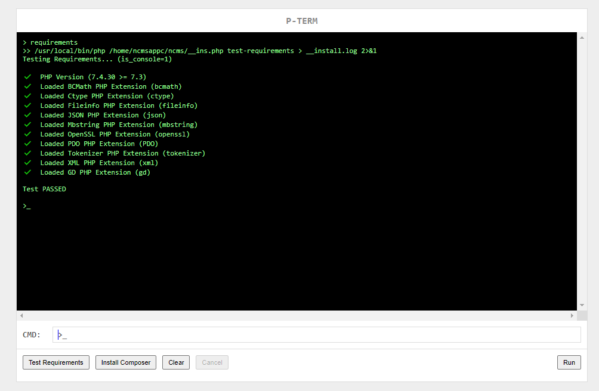

## PTERM

#

A PHP/HTML/JS terminal emulator.

**Runs on any PHP server and accessed from any web browser.**

> This provides a simple html interface where you can execute php, composer, and other commands directly from the browser. The commands are executed on a separate resumable cached process thread with output logs.

*This is especially useful when no terminal access is available like in the case of shared/limited user apache server.*

#

## Usage
Combine the source into one file: *``(i.e __pterm.php)``*

```sh
$ php combine.php
```

Import the combined source from your working folder.
Uses ``getcwd()`` as commands working directory.

```php
<?php
#localhost/pterm.php
chdir($BASE_DIR = realpath(__DIR__ . '/../ncms'));
require_once $BASE_DIR . '/__pterm.php';
```

Now the app can be accessed by browsing to the includes file.
(i.e. localhost/pterm.php in the above example)

#



**By [@xthukuh](https://github.com/xthukuh)**